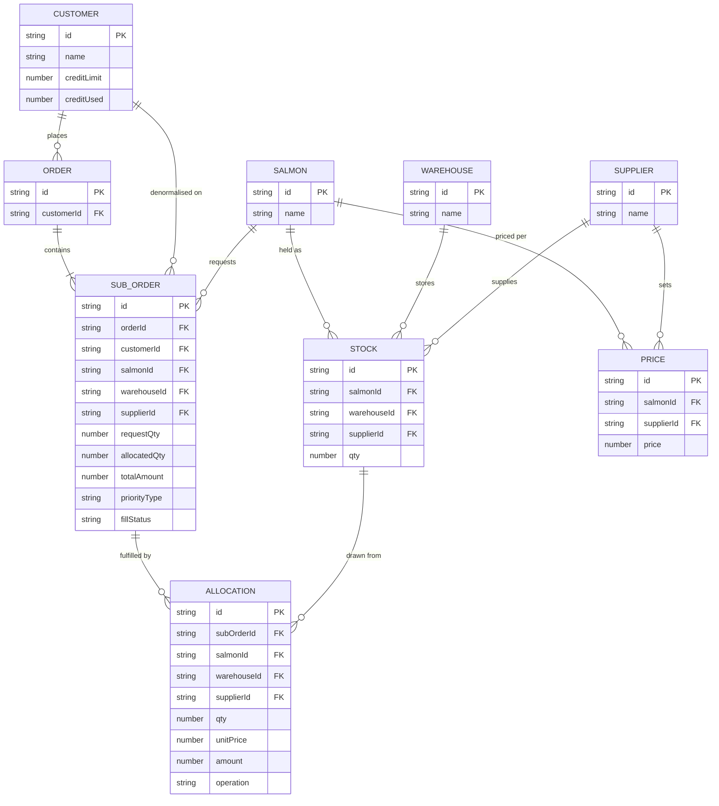

# SALMONERIA

TLDR: salmon order allocation dashboard — matches sub orders to warehouse stock by priority, credit, and price, with manual override. Design and core logic (engine, store, data model) are mine; AI (Claude) only helped with cosmetic polish.

Live: https://salmoneria.motionbi.work/

## Run

```bash
npm install
npm run dev        # http://localhost:3000
npm test            # unit tests (vitest)
npm run typecheck
```

## Project structure

```
app/          Next.js pages (dashboard shell, layout)
components/   Dialogs, table, credit card, shared ui/ primitives
lib/engine/   Allocation/pricing engine (core logic)
lib/mock/     Deterministic mock data generation
lib/          Types, constants, money & formatting helpers
store/        Zustand store wiring the engine to the UI
tests/        Vitest unit tests, one file per engine concern
```

## Data model


