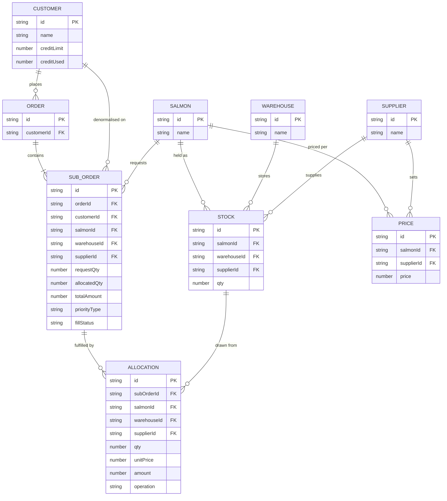

# SALMONERIA

TLDR: salmon order allocation dashboard — matches sub orders to warehouse stock by priority, credit, and price, with manual override. Design and core logic (engine, store, data model) are mine; AI (Claude) helped with cosmetic polish, tests, and some utility logic for better UX/data presentation.

Live: https://salmoneria.motionbi.work/

## Run

```bash
npm install
npm run dev        # http://localhost:3000
npm test            # unit tests (vitest)
npm run typecheck
```

## Project structure

```
app/          Next.js pages (dashboard shell, layout)
components/   Dialogs, table, credit card, shared ui/ primitives
lib/engine/   Allocation/pricing engine (core logic)
lib/mock/     Deterministic mock data generation
lib/          Types, constants, money & formatting helpers
store/        Zustand store wiring the engine to the UI
tests/        Vitest unit tests, one file per engine concern
```

## Algorithm

Sort sub orders (priority → date → id) → match eligible stock (salmon/warehouse/supplier, highest qty first) → price it (base × priority tier) → fill with `min(stock, qty needed, credit left)`, partial allowed. Manual override reuses the same fill logic, just for one chosen stock. Money uses `decimal.js` (round-half-even) to avoid float drift.

## Performance

- Table is virtualized (`@tanstack/react-virtual`) — smooth scroll at 5,000–10,000 rows.
- Allocation pass is a single O(n log n) sort + per-order stock scan, no repeated lookups (customers resolved via id map).
- Mock data generation is seeded/deterministic and scales pool sizes with dataset size.
- Large resets show a "Resetting…" state instead of freezing the UI.

## Ease of use

- Sortable/filterable table, newest-first by default, tooltips on truncated cells.
- Selects (customer/salmon/warehouse/supplier) show remaining credit/qty inline, so invalid picks are obvious before submitting.
- Manual override dialog to redirect a sub order to a specific stock.
- Responsive layout; state persists in `localStorage` across refreshes.

## Initiative

- Configurable Reset Dataset (seed + size) instead of one fixed dataset.
- Order stats bar (today's allocated vs. requested).
- Decimal-safe money math to avoid rounding drift.
- Shared pick logic between auto-fill and manual assign, so both stay consistent.
- Actually deployed it (see below).

## Deploy (Bonus)

Live on **Cloudflare Workers** via `@opennextjs/cloudflare`: https://salmoneria.motionbi.work/

```bash
npm run preview   # build + local preview
npm run deploy    # build + wrangler deploy
```

## Data model


