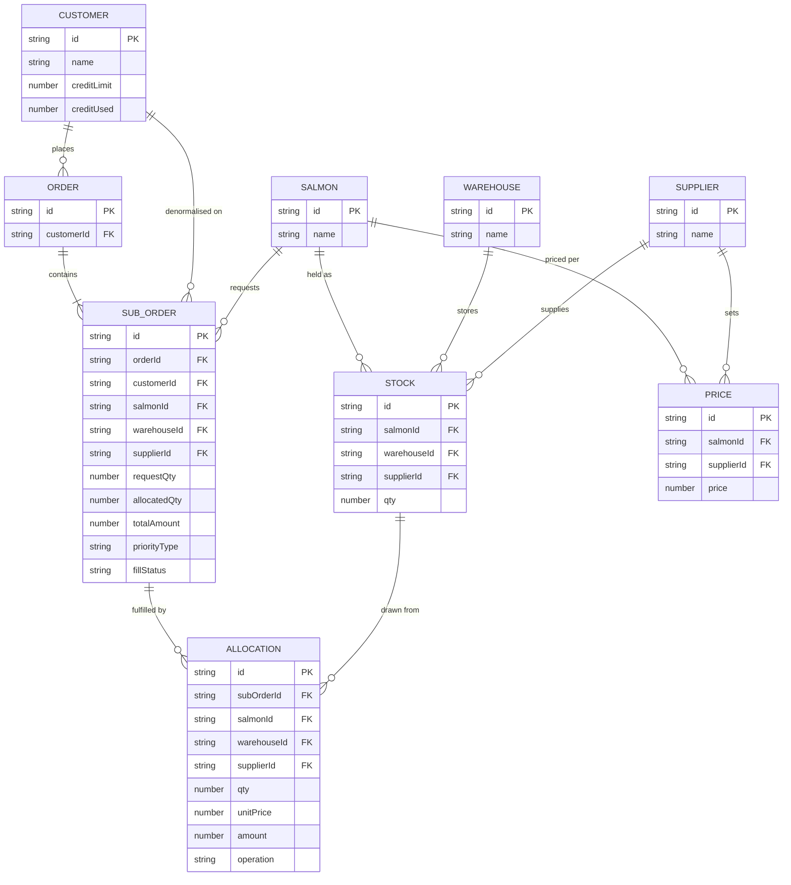

# SALMONERIA

TLDR: salmon order allocation dashboard — matches sub orders to warehouse stock by priority, credit, and price, with manual override.

Live: https://salmoneria.motionbi.work/

## Run

```bash
npm install
npm run dev        # http://localhost:3000
npm test            # unit tests (vitest)
npm run typecheck
```

## Project structure

```
app/                        Next.js app router entry
  page.tsx                  Dashboard shell — wires the store to the table and dialogs
  layout.tsx, globals.css   Root layout and global styles

components/
  sub-orders-table.tsx      Main virtualized table of sub orders, fill status, and actions
  customer-credit-card.tsx  Per-customer credit limit / used display
  create-order-dialog.tsx   Dialog to create a new order + sub orders
  manual-assign-dialog.tsx  Dialog for manually assigning stock to a sub order (overrides auto-fill)
  reset-dataset-dialog.tsx  Dialog to reset the mock dataset back to its seeded state
  ui/                       Shared shadcn/ui primitives (button, dialog, card, table bits, etc.)

lib/
  types.ts                  Core domain types (Customer, SubOrder, Stock, Price, Allocation, ...)
  constants.ts               Priority ordering, price tiers, wildcard warehouse/supplier ids
  money.ts                    Decimal-safe money helpers (round2, floor, plus/minus/multiply/divide)
  utils.ts                    Formatting helpers (id/money/date) and `cn` classname util
  engine/                     Allocation/pricing engine — the core business logic
    allocate.ts                Runs the full auto-allocation pass over all sub orders
    fill.ts                     Fills a single sub order from available stock, records an Allocation
    manual.ts                   Manual stock assignment / override path
    price.ts                    Resolves unit price for a salmon+supplier+priority combination
    sort.ts                     Sub order priority sort (EMERGENCY > OVER_DUE > DAILY, then date/id)
    stock.ts                    Stock lookup/matching (warehouse/supplier wildcards)
  mock/                        Deterministic mock data generation
    data.ts                     Static reference data (salmons, warehouses, suppliers)
    generate.ts                 Generates a full dataset (customers, orders, sub orders, stock, prices)
    seed.ts                     Seeded RNG + id helpers so "reset" always reproduces the same dataset

store/
  use-allocation.ts           Zustand store (persisted) holding the dataset and dispatching engine calls

tests/                        Vitest unit tests, one file per engine concern (allocate, fill, manual, price, sort, stock, money)
```

## Design & credit

Design, architecture, and the allocation/pricing/manual-assign engine (`lib/engine`), state store, and data model are designed and implemented by me. Claude (Anthropic) was used as a coding assistant for cosmetic polish and small utilities (formatting helpers, UI primitive tweaks, this README) — a deliberate demo of AI-assisted prompting, not core logic.

## Data model


